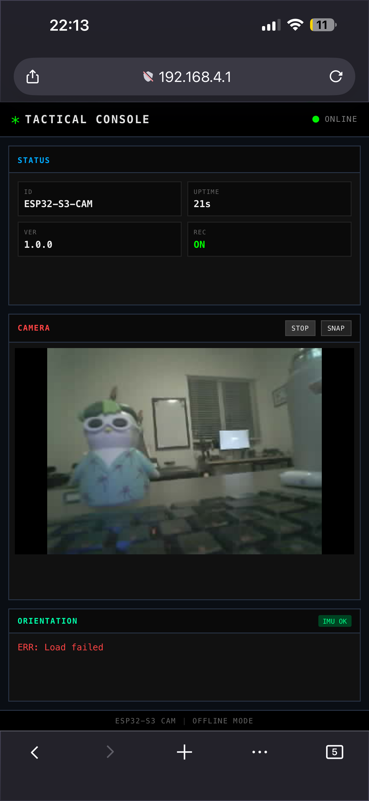
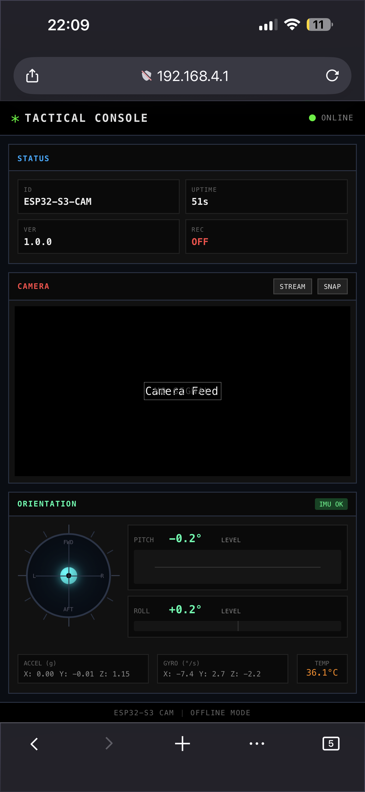

# Tactical Console

An example of using **Svelte** and **Bun** to build an offline-first web UI that runs on embedded systems. The frontend is compiled and bundled into C++ header files, then flashed directly onto an ESP32-S3 where it's served from the device's own web server - no cloud, no internet, no external dependencies.

## Gallery

<table>
  <tr>
    <td width="50%" align="center">
      <strong>Camera Feed</strong><br>
      
    </td>
    <td width="50%" align="center">
      <strong>IMU Orientation</strong><br>
      
    </td>
  </tr>
</table>

---

## Features

- **Live Camera Feed** - MJPEG streaming from OV2640/OV3660 camera
- **IMU Orientation** - Real-time pitch/roll from MPU-6050 gyroscope/accelerometer
- **Self-Hosted Web UI** - Served directly from ESP32 flash memory
- **Offline Operation** - Device creates its own WiFi network, no internet required
- **Bun as Build Tool** - Compiles Svelte to embedded-ready assets

---

## How It Works

```
BUILD TIME (on your computer)
┌─────────────────────────────────────────────────────────────────────┐
│                                                                     │
│  Svelte Components ──► Bun Build ──► main.js ──► web_assets.h      │
│  (src/ui/*.svelte)      (compile,     (bundled    (C++ PROGMEM     │
│                          minify)       JS+CSS)     string)          │
│                                                                     │
└─────────────────────────────────────────────────────────────────────┘
                              │
                              ▼ Flash via Arduino
┌─────────────────────────────────────────────────────────────────────┐
│                        RUNTIME (on ESP32)                           │
│                                                                     │
│  Browser ◄──── WiFi ────► ESP32 WebServer (C++)                    │
│     │                          │                                    │
│     │  GET /                   └──► Serve index.html from flash    │
│     │  GET /api/telemetry      └──► Read MPU-6050 via I2C          │
│     │  GET /api/stream         └──► Stream camera frames           │
│                                                                     │
└─────────────────────────────────────────────────────────────────────┘
```

**Bun is only used at build time** to compile Svelte and generate assets. The ESP32 runs pure C++ (Arduino) - no JavaScript runtime on the device.

---

## Quick Start

### Dependencies

- [Bun](https://bun.sh) - for building the frontend
- [arduino-cli](https://arduino.github.io/arduino-cli/) - for compiling and uploading

### 1. Build the Frontend

```bash
bun install
bun run build:esp32
```

### 2. Upload to ESP32

```bash
arduino-cli compile --fqbn esp32:esp32:XIAO_ESP32S3 tactical_console/
arduino-cli upload --fqbn esp32:esp32:XIAO_ESP32S3 -p /dev/cu.usbmodem* tactical_console/
```

### 3. Connect

1. Join WiFi network: **TacticalConsole** (password: `tactical123`)
2. Open browser: **http://192.168.4.1**

---

## Hardware

| Component           | Description                    | Connection |
| ------------------- | ------------------------------ | ---------- |
| XIAO ESP32-S3 Sense | Main board with camera         | -          |
| MPU-6050            | 6-axis gyroscope/accelerometer | I2C        |

### MPU-6050 Wiring

| MPU-6050 Pin | ESP32-S3 Pin |
| ------------ | ------------ |
| VCC          | 3V3          |
| GND          | GND          |
| SCL          | D5 (GPIO6)   |
| SDA          | D4 (GPIO5)   |
| ADO          | GND          |

---

## Project Structure

```
tactical-console/
├── tactical_console/         # Arduino sketch (runs on ESP32)
│   ├── tactical_console.ino  # WebServer + camera + IMU
│   ├── camera_pins.h         # GPIO config
│   └── web_assets.h          # Generated frontend (PROGMEM)
├── src/
│   ├── server/               # Dev server (mock data for testing UI)
│   └── ui/                   # Svelte frontend
├── build.ts                  # Custom Svelte bundler for Bun
└── package.json
```

---

## Development

The dev server provides mock sensor data so you can work on the UI without hardware:

```bash
bun run dev        # Start dev server at localhost:3000
bun run build      # Build frontend only
bun run build:esp32 # Build + generate ESP32 assets
bun test           # Run tests
```

---

## Custom Svelte Bundler

Bun doesn't natively compile `.svelte` files. The custom plugin in `build.ts`:

1. **Intercepts** `.svelte` imports during bundling
2. **Preprocesses** TypeScript using Bun's transpiler
3. **Compiles** Svelte to vanilla JavaScript
4. **Injects** CSS into the JS bundle

| Option     | Value        | Purpose                       |
| ---------- | ------------ | ----------------------------- |
| `generate` | `"dom"`      | DOM manipulation code         |
| `css`      | `"injected"` | Embed styles in JS bundle     |
| `dev`      | `false`      | Production mode, smaller size |

---

## Build Output

| Component      | File                  | Size    |
| -------------- | --------------------- | ------- |
| Frontend HTML  | `dist/index.html`     | 545 B   |
| Frontend JS    | `dist/assets/main.js` | ~30 KB  |
| ESP32 firmware | `.bin`                | ~1.2 MB |

---

## Disclaimer

Portions of this codebase were generated with assistance from a private LLM hosted and operated locally. All generated code has been reviewed, tested, and modified as needed.
